# Low-Light & Night-Time Object Detection System

This MVP project demonstrates a fast, lightweight AI pipeline to detect objects in low-light or night-time environments without requiring heavy custom model training. It uses classical computer vision for fast image enhancement, followed by a state-of-the-art pre-trained deep learning detector.

## Architecture Pipeline

1. **Input**: Accepts image files, video files, or a live webcam (`0`).
2. **Low-Light Enhancement**: Applies a fast combination of noise reduction, Gamma Correction, and Contrast Limited Adaptive Histogram Equalization (CLAHE) using OpenCV to illuminate dark regions.
3. **Detection**: Passes the enhanced image to Ultralytics YOLOv8 (Nano version) for fast and accurate object bounding-box detection.
4. **Output**: Displays the Original, Enhanced, and Detected images side-by-side in real-time, and saves the output locally.

## Workflow Flowchart

```mermaid
graph TD
    %% Define Colors
    classDef frontend fill:#3b82f6,stroke:#1e3a8a,color:#fff,stroke-width:2px,rx:10px;
    classDef api fill:#10b981,stroke:#064e3b,color:#fff,stroke-width:2px,rx:10px;
    classDef cv fill:#8b5cf6,stroke:#4c1d95,color:#fff,stroke-width:2px,rx:10px;
    classDef ml fill:#f59e0b,stroke:#b45309,color:#fff,stroke-width:2px,rx:10px;

    %% Inputs
    User["👤 User (Web Browser)"]:::frontend
    img["🖼️ Upload Dark Image"]

    %% Frontend execution
    User --> |Drag & Drop| img
    img --> React["⚛️ React Frontend (Vite)"]:::frontend

    subgraph "Backend AI Server (Python Flask)"
        direction TB
        Endpoint["🌐 API: /upload"]:::api
        Read["📖 cv2.imread(original)"]:::cv
        Enhance["✨ enhancement.py"]:::cv
        subgraph "Classical Computer Vision"
            Gamma["Gamma Correction"]
            CLAHE["CLAHE Processing"]
            Noise["Noise Reduction"]
        end
        Detect["🤖 detector.py (YOLOv8n)"]:::ml
        OutputGen["💾 Save Output Locally"]:::api

        Endpoint --> Read
        Read --> Enhance
        Enhance -.-> Gamma -.-> CLAHE -.-> Noise
        Enhance --> |Enhanced Output| Detect
        Detect --> |Bounding Boxes| OutputGen
    end

    React --> |POST| Endpoint
    OutputGen --> |Returns URLs| React

    React --> Screen["💻 Display Side-by-Side: Original, Enhanced, Detected"]:::frontend
```



## Project Structure

```text
nightLight-Detection/
├── main.py             # CLI Entry point and main processing logic
├── enhancement.py      # Gamma and CLAHE enhancement functions
├── detector.py         # YOLOv8 Object detection wrapper
├── utils.py            # Helper functions for display and saving
├── requirements.txt    # Python dependencies
├── README.md           # This file
├── sample_inputs/      # Directory to place your test images/videos
└── outputs/            # Directory where results are saved
```

## Setup Instructions

1. **Install Dependencies**
   Ensure you have Python 3.8+ installed. From the `nightLight-Detection` directory, run:
   ```bash
   pip install -r requirements.txt
   ```
   _(Note: This might take a minute to download PyTorch and Ultralytics YOLO and its dependencies)_

## Usage

### Image Detection

Run the pipeline on a single image. The result window will wait for you to press any key to close.

```bash
python main.py --image path/to/dark_image.jpg
```

### Video Detection

Run the pipeline on a video file.

```bash
python main.py --video path/to/dark_video.mp4
```

### Live Webcam Detection

Run the pipeline on your live webcam (if you have one connected). Press `q` to quit the live feed.

```bash
python main.py --video 0
```

### Additional Options

- Add `--no-show` to quickly process files in the background without opening UI windows:
  ```bash
  python main.py --image dark_image.jpg --no-show
  ```
- Change the output directory (default is `outputs/`):
  ```bash
  python main.py --image dark_image.jpg --output-dir my_custom_results
  ```
